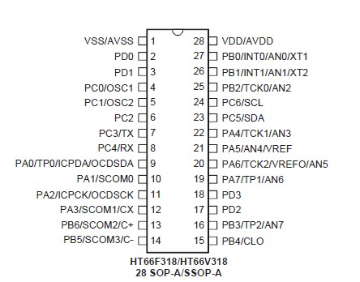

## ※UARTtoADCwith8bitsMCU
* Host PC or Raspberry Pi... UART port access GPIO, LED matrix, EEPROM, ADC, I2C...(Same RS-485 port) via MCU HT66F318 UART port. baudrate 9600,n,8,1  
此專案利用主機PC軟件下達UART指令以存取MCU內部的EEPROM(64bytes), ADC(12bits), 後續還可以持續增加I2C(Hi resolution adc), SPI(OLED display) 都透過UART port 
* MCU ADC設置直接透過AN0~AN7讀取外部輸入,或AVDD,AVDD1/2,AVDD1/4讀取內部輸入 

* Project Option: 
HXT (External 8MHz X'tal): 可選項有:HXT(400K~16Mhz),HIRC4M,HIRC8M,HIRC12M 
LICR (Low speed internal RC for TB0/TB1): 可選項有:LXT(32.768Khz),LIRC(32Khz) 
WatchDog: enable 

* UART Baudrate: 9600,n,8,1 (協議格式參照RS-485通訊協議格式) 

* TB0,1 enable LIRC interrupt for 16ms, 0.514sec 

* TM0 enable HXT interrupt for 200us 

* HT-IDE3000 HT66F317/HT66F318 28ssop with HT-IDE3000 & e-Link & e-WriterPro 
文件[HT66F318 Document](https://www.holtek.com.tw/search?key=ht66F318) 
模擬&除錯Development & Debug[IDE3000 & ICE](https://www.holtek.com.tw/web/guest/ice) 
燒入器Progrmming & writer[HOPE3000 & e-WriterPro](https://www.holtek.com.tw/web/guest/programmer) 

### Relevant information
* HT-IDE3000 V8.02

* HOLTEK C Compiler V3/Assembly

* HT66F318 Config, used 8Mhz X'tal external, VDD/VDDA binding

* HT66F318 28ssop Schematic Diagram

### How to test or used
利用PC通訊軟件做為主動工具, 協議(9600,n,8,1), 格式比照RS-485格式(PC指令CRC用 A0 0A代替, MCU反饋的為CRC-16)

* For Example: 
* UART Formate(Get from MCU): 44 03 00 00 00 04 A0 0A   #讀取EEPROM位址0x0000,4組(共計8個bytes)
MCU return設計最大每次讀取四組(8byte) 所以反饋時: 44 03 08 00 01 02 03 04 05 06 07 CRC CRC

* UART Formate(Write to MCU): 44 06 00 0A EE FF A0 0A   #寫入EEPROM位址0x000A,資料為0xEEFF
MCU return: 44 06 00 0A EE FF CRC CRC

* UART Formate(Get from MCU): 44 03 01 08 00 01 A0 0A   #讀取ADC通道8(AVDD/2), 1組2個bytes, 有10通道可以讀取(an0~an7,internal)
MCU return adc value (an0 to an7): 44 03 02 FF 03 CRC CRC
MCU return adc value (an0 to an7): 44 03 02 08 02 F3 8A

### Other applications
* UART access to ADC converter(HY3118 24bit ADC) via I2C bus.
* UART access to OLED 16x2 display driver via SPI bus.

